# Final Results

The survey ran for approximately one month (October 14 – November 16, 2025) and received 120 responses. Only 2 participants submitted incomplete forms, representing a 98.3% completion rate.

With an estimated PX4 autopilot user base of 15,000, this sample size yields a margin of error of 9% at a 95% confidence interval. This exceeds the commonly recommended 5% margin of error for surveys, which should be considered when interpreting results and developing recommendations.

## Professions and Domains

The survey revealed that the largest respondent group consisted of "Professional Engineers/Technical Consultants" (54%), followed by "Researchers" (23%) and "Students" (15%) (see @fig-proffdomains). By domain, 44% of respondents worked in commercial aerospace or drone businesses, followed by "Academia and Education" (18%) and "Defense/Government" (16%).

::: {#fig-proffdomains layout-ncol=2}

(Left) Pie-chart showing the primary professions of the survey's participants and (right) pie-chart with the distribution of domains of the survey participants.
:::

## Experience

In terms of PX4 autopilot experience, the largest group of participants had 1-3 years of experience (33%), followed by those with 1 month to 1 year (20%), and those with over 5 years (17%). Regarding simulator expertise, most respondents rated themselves as intermediate users (39%), followed by advanced users (34%), with novices comprising the third-largest group (17%). Please see @fig-experience.

::: {#fig-experience layout-ncol=2}

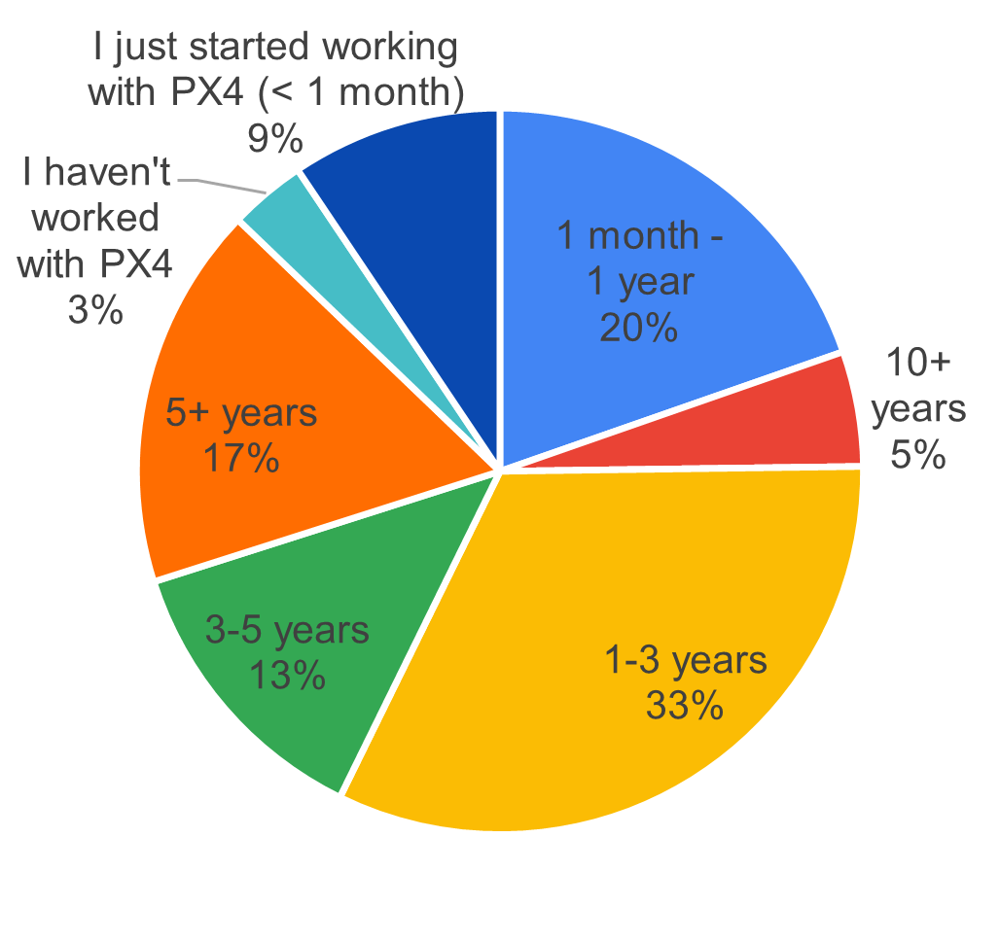

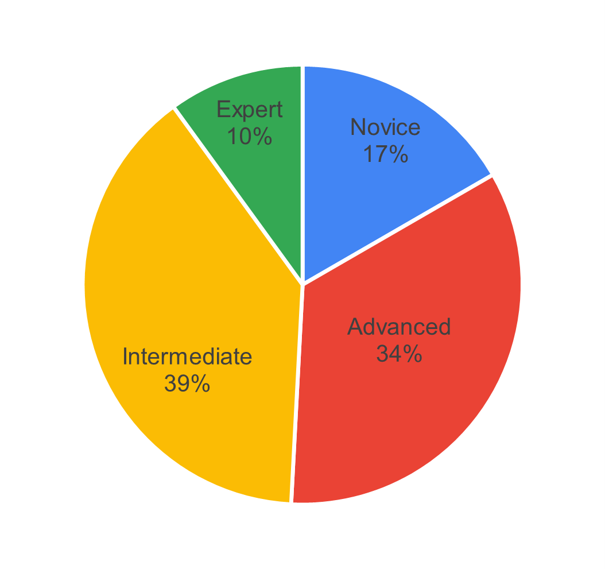

(Left) Pie-chart showing the PX4 experience of the participants and (right) pie-chart showing the robot simulation experience.
:::

## Profile of Personas

Based on these responses, we identified five distinct user personas depicted in Figure 3: "Senior Engineers (P1)," "Junior Engineers (P2)," "Academic Researchers (P3)," "Academic Students (P4)," and "Independent Hobbyists (P5)."
These personas will be used to analyze and interpret the survey results in subsequent sections as depected in @fig-personas.

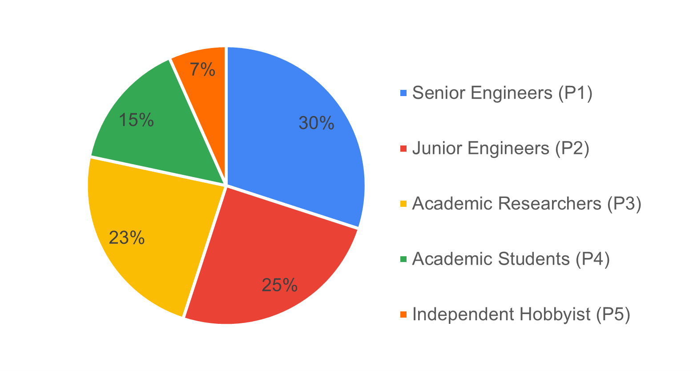{#fig-personas}

### P1 -  Senior engineers
Highly experienced professional engineers with advanced to expert-level simulation expertise. These are the power users who deploy PX4 simulators in production environments for commercial products, defense systems, and critical applications.

* Profession: Professional Engineer / Technical Consultant
* Expertise Level: Advanced: 27 (75%) / Expert: 9 (25%)
* Primary Domains: Aerospace/Drones (Commercial): 24 (67%), Defense/Government: 10 (28%), Research Institutions: 1 (3%), Other: 1 (2%)

### P2 -  Junior Engineers
Professional engineers in commercial or defense settings who are building their drone and simulation expertise. This includes career switchers, new hires at drone companies, and engineers expanding their skillset to include simulation tools.

* Profession: Professional Engineer / Technical Consultant
* Expertise Level: Intermediate: 20 (69%), Novice: 9 (31%)
* Primary Domains: Aerospace/Drones (Commercial): 18 (62%), Defense/Government: 6 (21%), Research Institutions: 2 (7%) and Other: 3 (10%)

### P3 - Academic Researchers
Academic and industry researchers using PX4 simulators for cutting-edge research, publications, and experimental work. This group spans university researchers, PhD students/postdocs, and R&D engineers at companies and research institutions.

* Profession: Researcher (Academic/Industry)
* Expertise Level: Intermediate: 14 (50%), Advanced: 11 (39%), Expert: 2 (7%), Novice: 1 (4%)
* Primary Domains: Academia/Education: 10 (36%), Aerospace/Drones (Commercial): 7 (25%), Research Institutions: 7 (25%), Defense/Government: 3 (11%), Aerospace/Drones (Hobbyist): 1 (3%)

### P4 -  Academic Researchers
University students (BSc/MSc level) learning drone simulation as part of their coursework, research projects, or thesis work. This is the entry-level academic segment that represents the future pipeline of PX4 developers and users.

* Profession: Student (BSc/MSc)
* Expertise Level: Intermediate: 7 (39%), Novice: 8 (44%), Advanced: 2 (11%) and Expert: 1 (6%)
* Primary Domains: Academia/Education: 12 (67%), Aerospace/Drones (Hobbyist): 3 (17%), Aerospace/Drones (Commercial): 2 (11%) and Other: 1 (5%)

### P5 - Independent Hobbyists
Drone enthusiasts, hobbyists, and independent developers exploring PX4 for personal projects, skill development, or potential commercial opportunities. This small but passionate group contributes to community growth and grassroots adoption.

* Profession: Hobbyist / Independent Developer / Non-professional
* Expertise Level: Intermediate: 5 (63%), Novice: 2 (25%) and Advanced: 1 (12%)
* Primary Domains: Aerospace/Drones (Hobbyist): 6 (75%), Aerospace/Drones (Commercial): 1 (12%) and Robotics: 1 (12%)

## Participants Experience with Simulation

This section presents results on participants' past simulation experience and currently used simulators, as well as data on simulated vehicle types and hardware specifications. 

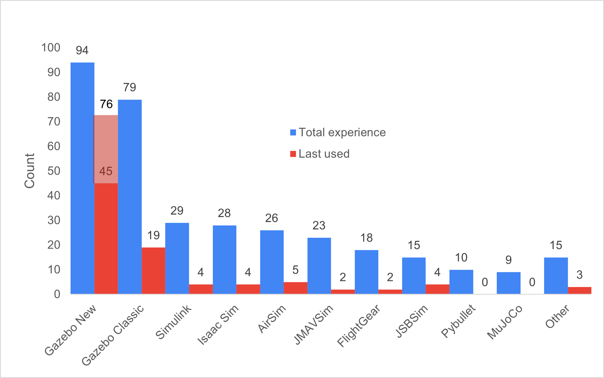{#fig-sim-experience}

### Simulation Past Experience

Participants listed all simulators they had previously used, as shown in @fig-sim-experience. The two most common were Gazebo (New) with 94 responses and Gazebo Classic with 79 responses, the two officially supported simulators for PX4 autopilot. Usage drops significantly after these, with Simulink (29), Isaac Sim (28), and AirSim (26) following. The "Other" category included X-Plane, Webots, CoppeliaSim, SIH, and several custom-built simulators.

### Simulation Current Use
@fig-sim-experience also shows current simulator usage based on an open-ended question. Due to ambiguity about which version of Gazebo participants were using, the following post-processing classifications were applied:

* Participants with experience only in Gazebo Classic were classified as currently using Gazebo Classic
* Participants with experience only in Gazebo New were classified as currently using Gazebo New
* Participants who specified "gz sim," version names (Harmonic/Ionic), or clarified in comments were classified as Gazebo New

After this classification, 30 participants who had used both versions could not be definitively categorized. These are shown in light red in Figure 5, with the assumption they likely use the most current and recommended simulator (Gazebo New), though this metric should be interpreted with caution.
Overall, Gazebo New remains the most widely used simulator (46 confirmed users), followed by Gazebo Classic (19). AirSim and its forks account for 5 current users, while Simulink and JSBSim each have 4 users.

### Summary of Comments on Gazebo New
Since Gazebo New is the most widely used simulator, the following summarizes user feedback on its strengths and weaknesses. Users appreciate the versatility of Gazebo New and its seamless integration with both PX4 SITL and ROS 2. They value the wide variety of available sensors—a feature lacking in many other simulators—as well as its open-source nature and large community support. Users also noted significant improvements in the physics model compared to Gazebo Classic.

However, users identified several areas needing improvement. Multiple participants reported instability on operating systems other than Ubuntu, particularly macOS. Many prefer Gazebo Classic's GUI, describing it as less complex to work with. Adding custom sensors through the plugin framework and creating custom vehicle models pose significant challenges for many developers, particularly due to inadequate documentation. Beginners especially struggle to find appropriate documentation.

Academic researchers (P3) specifically noted that Gazebo is not well-suited for reinforcement learning applications, leading them to use alternative simulators for this purpose. They also requested better multi-vehicle simulation support, such as the ability to simplify or disable physics for certain vehicles. Additionally, while some users praised the updated physics, others reported that flight dynamics and environmental variables still fall short of requirements.

### Simualated Vehicles

Participants indicated which vehicle types and payloads they typically simulate (fig-simulated-robots). Quadcopters are the most commonly simulated vehicle type (104), followed by multicopters (52), with fixed-wing and VTOL vehicles tied for third (50 each). For payloads, cameras are most prevalent (103), followed by range sensors such as LiDAR/ToF sensors (88), with gimbals and communication equipment sharing third place.

Regarding the number of vehicles simulated simultaneously, the majority simulate only one vehicle (63%), followed by those who typically simulate 5-10 vehicles (26%), and 7% who simulate teams of 2-4 vehicles.

@fig-swarms shows the hardware specifications participants use to run their simulators. The majority use PCs with dedicated GPUs, with Ubuntu as the dominant operating system. Most participants run simulators locally on their machines rather than on remote servers.

::: {#fig-simulated-robots layout-ncol=2}

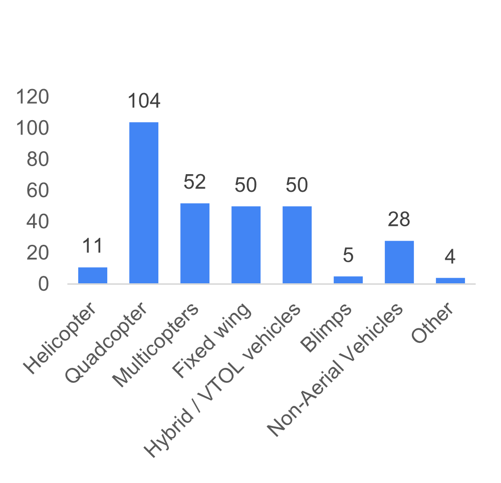

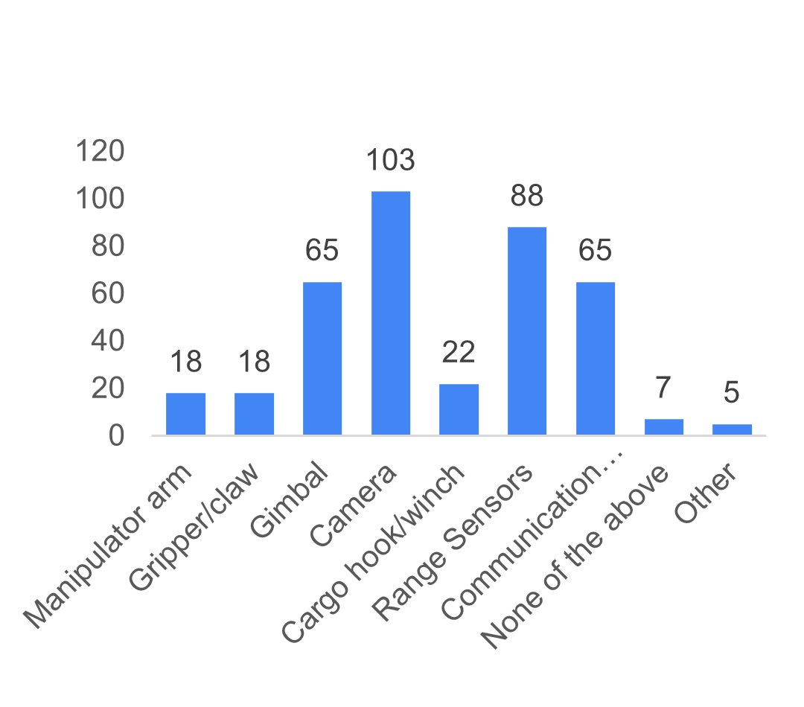

(Left) Bar graph with the different types simulated vehicles and (right) bar graph with the distribution of type of payloads simulated.
:::

{#fig-swarms}

### Simulation Hosts Specifications

The survey also had some questions about the host computers that is running the simulation, in terms of GPU-enabled, OS distribution, or the actual location of the simulation compared to the development PC. These are vizualized in @fig-simulation-hosts. 

::: {#fig-simulation-hosts layout-ncol=3}

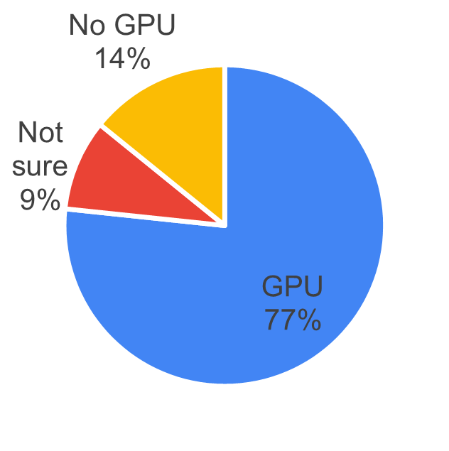

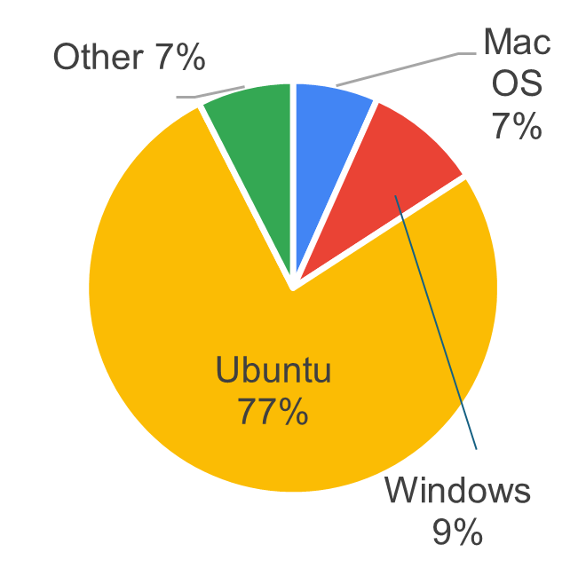

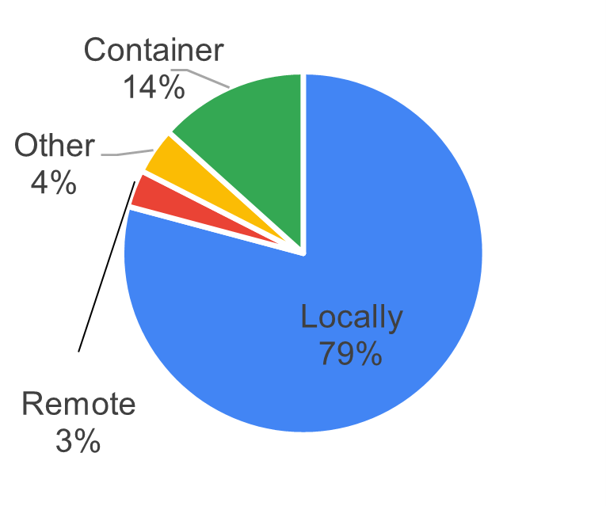

Pie- charts with the (left) GPU-enabled machines, the OS distribution (middle) and running location of the simulation (right).

:::

## Purpose and goals

### Purpose for Using Simulators

@fig-purposes displays the reasons and purposes for using simulators. Participants most commonly use simulators for testing before real flights (89), followed by algorithm development (84) and robot prototyping and design (59).

The radar graph on the right of @fig-purposes shows that both academic researchers and students also emphasize academic research and education/learning. Senior engineers (P1) strongly prioritize commercial product development, followed by junior engineers (P2) and independent developers/hobbyists (P5). Students (P4) and hobbyists (P5) also occasionally use simulation for competition preparation.

::: {#fig-purposes layout-ncol=2}

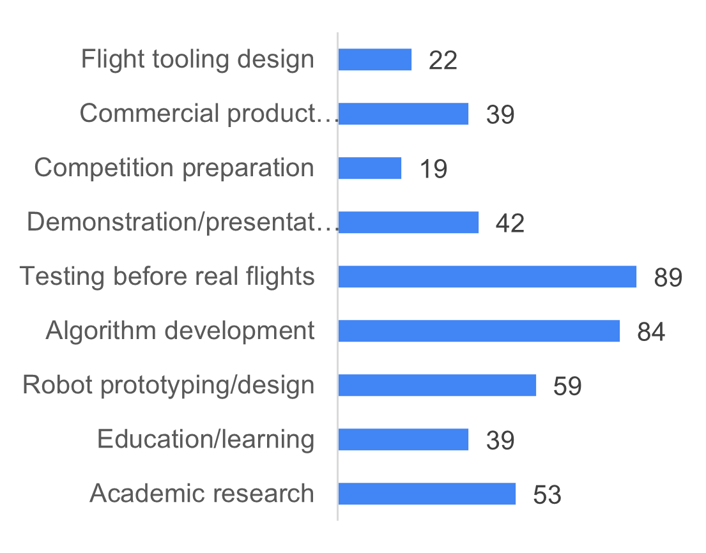

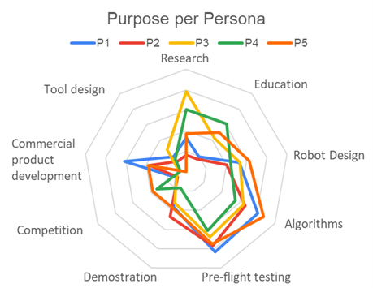

(Left) the bar graph with the count of indicated purposes of using simulators for all participants and (right) the radar graph with the purposes plotted per persona.

:::

### Goals of Using Simulators

The bar graph on the left of @fig-goals shows that all participants use simulators as development tools for their robotic systems, followed by mission planning and validation (74) and quality assurance in continuous integration (48). The radar graph on the right reveals that senior engineers (P1) drive the high CI/QA scores, while academic researchers (P3) and independent hobbyists (P5) also use simulators for generating machine learning training data. A portion of students (P4) and hobbyists (P5) additionally indicated using simulation for safety testing.

::: {#fig-goals layout-ncol=2}

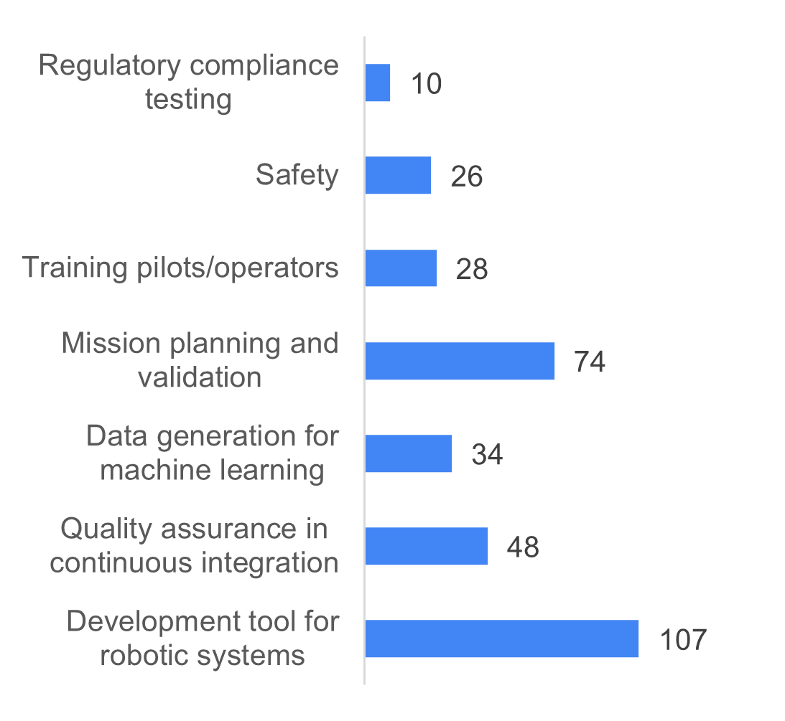

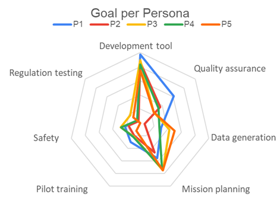

(Left) A bar graph of the goals of using simulators for all participants and (right) the radar graph with goals plotted per persona.

:::

## Features and Priorities

Participants rated the perceived importance of simulator features on a scale from 1 (least important) to 5 (very important) across four categories: technical capabilities, platform & compatibility, usability and accessibility, and advanced features. These ratings are also analyzed by persona, as defined in the previous section.

### Technical Capabilities

@tbl-tech presents the importance ratings for technical capabilities. Software-in-the-loop (SITL) is considered most important with a score of 4.63, followed by realistic physics simulation (4.38) and hardware-in-the-loop (3.82). Junior engineers (P2) showed a slightly different preference profile, rating failure mode simulation (3.96) and simulated networking capabilities (4.00) higher than other technical capabilities beyond SITL.

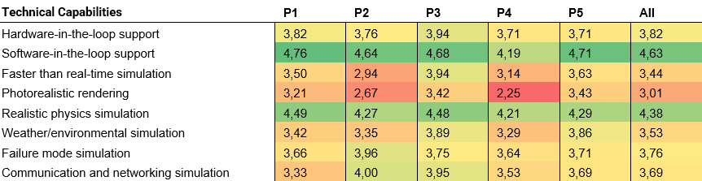{#tbl-tech}

### Platform and Compatibility

@tbl-plat shows that the highest-rated platform and compatibility feature is ROS/ROS2 integration (3.92), followed by network capabilities and version compatibility between different PX4 releases (both 3.82). Researchers (P3) prioritized this category more than any other persona profiles. Notable deviations include senior engineers (P1), who rated Docker/containerization support (3.81) higher than network capabilities, and independent developers/hobbyists (P5), who rated network capabilities significantly higher than all other platform and compatibility features. 

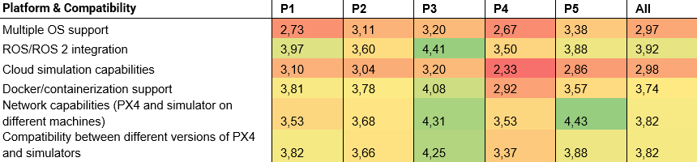{#tbl-plat}

### Usability and Accessibility

@tbl-use presents importance ratings for usability and accessibility features. Participants rated template and example library availability as most important (4.14), followed by real-time debugging support and easy installation process. Academic students (P4) prioritized this category more than any other persona. Academic researchers (P3), students (P4), and independent developers/hobbyists (P5) all rated real-time parameter tuning higher than easy installation process, deviating from the overall ranking.

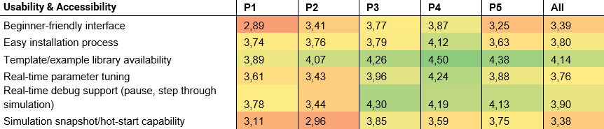{#tbl-use}

### Advanced Features

@tbl-adv lists the importance ratings for advanced simulation features. Across all participants, custom sensor model creation was rated most important (4.17), followed by easy robot model creation (4.13) and scenario scripting and automation (3.94). Academic researchers (P3) prioritized this category more than any other persona. Ratings were relatively consistent across personas, with the notable exception that independent developers/hobbyists (P5) also rated swarm simulation as highly important.

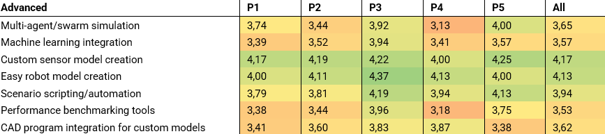{#tbl-adv}

### Top wanted functionalities

Across all personas, the top 5 most important features are:

1.	Software-in-the-loop support
2.	Realistic physics simulation
3.	Custom sensor model creation
4.	Template/example library availability
5.	Easy robot model creation

@tbl-top breaks down the top 5 features by persona. Software-in-the-loop capabilities are considered essential by all personas except students (P4), who prioritize template and example library availability and real-time parameter tuning more highly. Realistic physics simulation is universally valued, though independent developers/hobbyists (P5) rated network capabilities and template availability higher. ROS/ROS2 integration is more important to advanced simulator users (senior engineers (P1) and academic researchers (P3)) while both junior (P2) and senior engineers (P1) rated custom sensor creation and easy robot model creation as equally important.

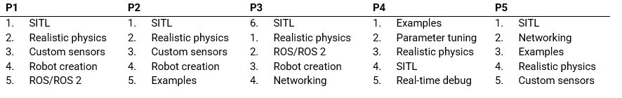{#tbl-top}

## Final choice for Priority Roadmap

In a final single-choice question, participants selected the one feature they would prioritize if only one item could be on the roadmap (see @fig-final). The largest group (18%) requested improvements to the current Gazebo integration with PX4 autopilot. Another 17% prioritized better documentation and examples for existing simulators, while 16% wanted more realistic physics and higher-quality sensor models.

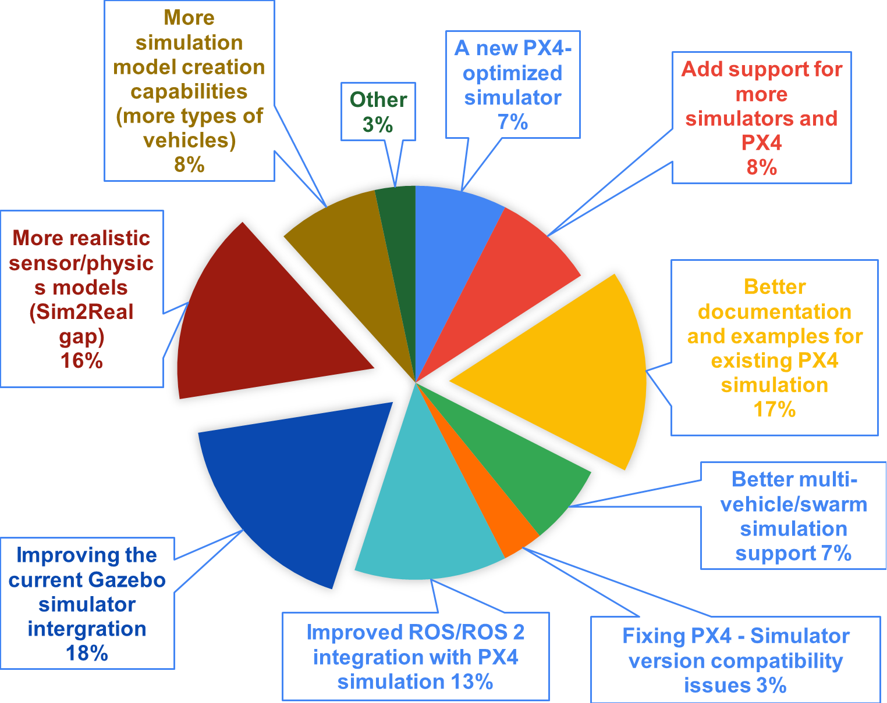{#fig-final}

@fig-final-per presents a bar chart showing how each persona influenced the roadmap priorities. Professional engineers, both senior (P1) and junior (P2), voted for improved Gazebo integration with PX4. Academic researchers (P3) prioritized more realistic sensor and physics models along with better multi-vehicle/swarm simulation support. A significant portion of senior engineers (P1) also voted for reducing the sim-to-real gap, while some advocated for a new PX4-optimized simulator. Junior engineers (P2) emphasized enhanced simulation creation capabilities. Both junior engineers (P2) and academic students (P4, representing novice and intermediate users, indicated they would benefit most from better documentation and examples for existing PX4 simulation integrations. Finally, both senior engineers (P1) and academic students (P4) requested improved ROS/ROS2 integration with PX4 simulation.

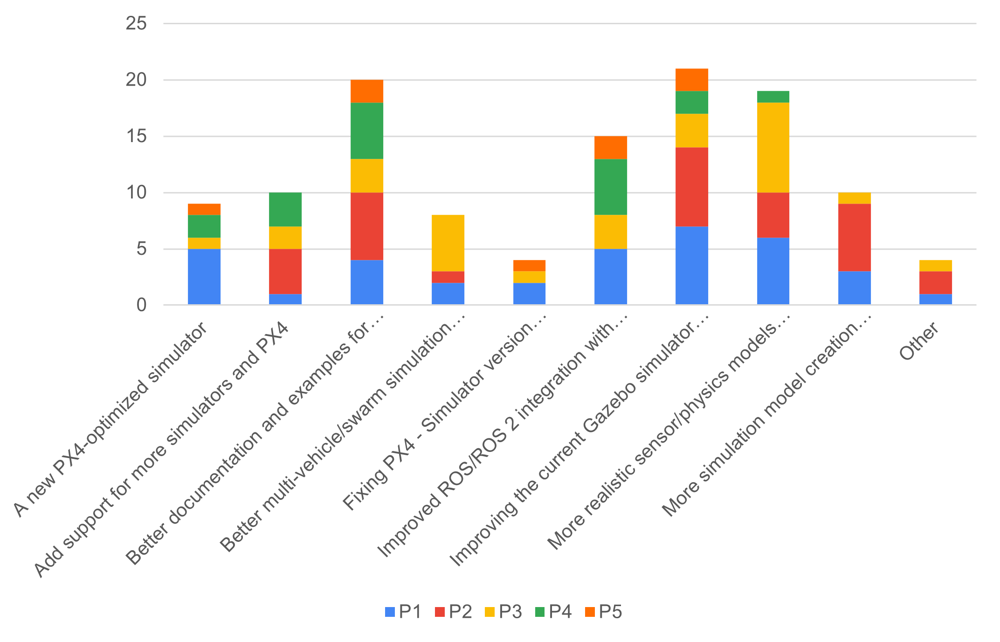{#fig-final-per}